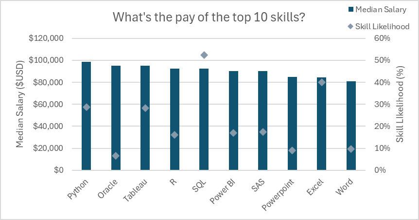

# 📊 Excel Salary Dashboard & Data Job Market Analysis

## 📌 About

This project presents an Excel-based analysis of the 2023 data jobs market, showcasing salary trends, job roles, and in-demand skills. Using tools like charts, Power Query, PivotTables, and DAX, the dashboards provide insights into how location, job title, and skillset affect compensation. It's designed to help job seekers make informed career decisions and understand the evolving landscape of data-related roles.

---

## 🗂️ Project Structure

---

## 📈 Dashboards

### 1️⃣ Salary Dashboard

- 🔹 **File:** `1_Salary_Dashboard.xlsx`
- 🔹 Visualizes median salaries by job title and country
- 🔹 Uses horizontal bar charts and map charts
- 🔹 Includes data validation for interactive filtering
- 🔹 Built with:
  - 📉 Charts (Bar, Map)
  - 🧮 Formulas (`MEDIAN`, `IF`, `FILTER`)
  - ❎ Data Validation

**Key Insights:**
- Senior roles and engineering jobs offer the highest median salaries
- Salaries vary significantly by country

### 2️⃣ Project Analysis Dashboard

- 🔹 Explores deeper questions:
  - Do more skills lead to higher salaries?
  - What are the top-paying skills?
  - Regional salary variations
- 🔹 Built using:
  - 🔍 Power Query (ETL)
  - 📊 PivotTables & Charts
  - 💪 Power Pivot & Data Models
  - 🧮 DAX for custom calculations

**Key Insights:**
- A clear correlation between number of skills and salary
- Python, SQL, AWS are top high-paying skills
- The US leads in average salaries for data professionals

---

## 📊 Excel Skills Used

- 📥 **Power Query:** Data cleaning and transformation
- 🧩 **Power Pivot:** Building relationships and data models
- 🧮 **DAX:** Custom measures like median salary
- 📊 **PivotTables & Charts:** For dynamic analysis
- 📉 **Standard Charts:** Bar and map visualizations
- ❎ **Data Validation:** Controlled filtering options

---

## 📸 Sample Visuals

> 
> *Median Salary by Job Title*

> 
> *Country-wise Median Salaries*

> 
> *Top 10 Skills vs Median Salary*

---

## 🎯 Conclusion

This Excel-based project uncovers critical insights about the data jobs landscape, empowering professionals to:
- Make informed salary comparisons
- Identify high-paying job titles
- Prioritize in-demand technical skills.
